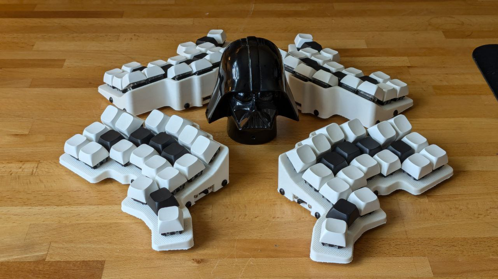

3d printed corne keyboard
==========================

this is my attempt to create a 3d printed split keyboard. I was intrigued to build an ergo mech split keyboard after seeing a yt video. My main goal was to learn to type with 10 fingers instead of using 3-4 fingers while constantly looking at my keyboard. I have succeeded. I am typing this on the above keyboard.

Reading into ergo mech keyboards i realised that i find the idea of the corne keyboard layout very interesting. I would summarize that you do not skip a key ro reach a key. Due to layers and modifiers it is not necessary to have more keys, i already know where I all find the keys I am looking for. One goal was to keep it as cheap as possible, since i own a 3d printer it was cheaper to print it than having pcbs made. That is also the reason I went for nice!nano clones with zmk. I also wanted to have low profile keys to save overall buildheight. I found cheap gateron switches/hotswaps and the rest is easy to source from ali express. Overall cost for one keyboard is around x €.

After the first version was build i realised that i had to lift my wrists slightly to reach the upper row. After some reasearch I decided that something like the dactyl was a bit too much, especially when trying to keep the build height low. So i only angled the upper row upwards. I am very happy how it turned out! I basically don't need to move my wrists when typing.

build
==========================

keymap
==========================

[keymap drawer by caksoylar](https://caksoylar.github.io/keymap-drawer?keymap_yaml=H4sIAAAAAAAC_51WzXLiRhC--yk6OIk2ibAM-Jf8yrKEWfOjWLIdsnGIABkoJMRKYlmKZQ855LxJqnJKVV4ghxzyBOs32SfJaHpGlrJarNoLX_NNfz09remWtkGrNxpQb0HPdrwF3I5tZwCLcTgCC55ZztwGZzyxYfXUnXQn9rLnWf6gCre2748DKVjY9my9tQ2eDyvPD0de17GW3jyswiqYOWOCoT-3RfC9RVCFigh9z5m7U2LvixCO5m6PmOV1FCKwbRiF4SyoStKQ7D_v7fQ9V-pbk8BbOpYvkd1da1Yc-NbC9qWe4_Uk1xpPpXO105T1rqGryo472MYEtlgeWwDpzPueP7W7vhdaoT1gqzznhtxpX5pdmnm38vygW4nC2H4QhRnYt9bcoRGLoBoKRfgW4RpBRbhAMBE6CJcIdYQ2go5w9ydFUz6huCK5yCKMqnBdb60h5gzKKeZFYx1zp5QzzuqaeU9qlJQbjIIawlns8DjtEFHnWYEaGTve_RGnlsqeZq3rGOa6bipnbP17hO8QWOGuEPDA0EJoxoEEURCB3A3hc-F-Z2GHkdUk-TUjP0iSRUZ2E6TRadLkgnDcnyzpeugNh46dcImO_38nxZoFcO35A_S7UM3YvyVftS43RjV0WVFj_xNDV6jLqUorGixdvFBQ-LHAjK-48RE3PuTGx9zYZsYP7P8nfGHNjRtuCNz4iRvfcOMLZtz9hfjm57_Zykvu8ikzJIRHjF7x9SfMEAoCY17_y6h3_RZecPHrf97l-ja9CpczuwojMp7I5IgKiJc8WWvY8Du1nk3nrNiCkIQ3v_wKeo2bFPUaMX-PV6_aDRTssEMeIhwhHCN8li4Zix71Dgv0iiEP_BtFEjzm-AbRVdl7u0X3s1r0IKNFC8VCukeljHOftZt4MZU2tp_aOk2uwy5CCaGMUKFQ-LKQETENeZ5YUnFLhnTQYwOWNgt2orCb6GHOlTK4cgZXyeD2hNTmWgmPpuFT1fCpascPHnATaCUsm7aHsI9wkOF6YoLSuHgwoqpDW9NY8F2GCCz_St7kVjmextByx9Nh-m3H30-b3nr5S8RmP73OSMgIBgJeRtDe7wHEfZd5f9nr5z3C3c_z-8Qfrif5kul55DOiCLMqPCmTRi4f3JDFCencyyiIQ2j2hSFGbwWRDawbLjlMStp6J4_miGgOmUaXDVPNIzomoiMmIvMjt5DMq0pChuPtIRH5IiynRK9yiEgpEgkqOVWkGMdpVZ4ES7silEpMp52TCUX6Nc_BonLsM11NbpIv7Nom2X_3DMMliAsAAA%3D%3D)

Thanks
==========================
