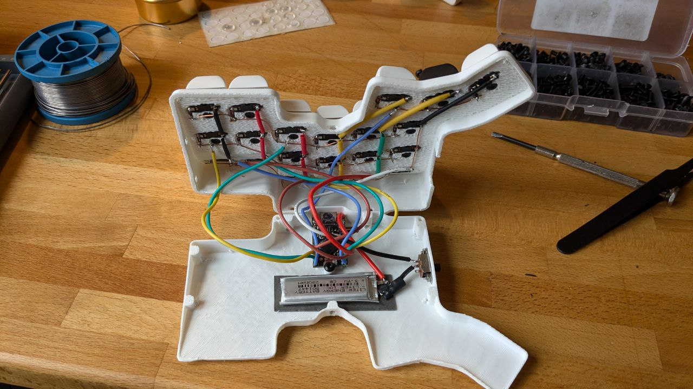

3d printed corne keyboard
==========================

this is my attempt to create a 3d printed split keyboard. I was intrigued to build an ergo mech split keyboard after seeing a yt video. My main goal was to learn to type with 10 fingers instead of using 3-4 fingers while constantly looking at my keyboard. I have succeeded. I am typing this on the above keyboard.

Reading into ergo mech keyboards i realised that i find the idea of the corne keyboard layout very interesting. I would summarize that you do not skip a key ro reach a key. Due to layers and modifiers it is not necessary to have more keys i think. For designing 3d models i use an extra numpad anyways. Other than that i don't miss any functionality. One goal was to keep it as cheap as possible, since i own a 3d printer it was cheaper to print it than having pcbs made. That is also the reason I went for nice!nano clones with zmk. I also wanted to have low profile keys to save overall buildheight. I found cheap gateron switches/hotswaps and the rest is easy to source from ali express.

After the first version was build i realised that i had to lift my wrists slightly to reach the upper row. After some reasearch I decided that something like the dactyl was a bit too much, especially when trying to keep the build height low. So i only angled the upper row upwards. I am very happy how it turned out! I basically don't need to move my wrists when typing.

build
==========================
The build is not too difficult. I have printed the parts in the natural orientation. After removing the support material, i drilled the holes for the hotswaps with a 3 mm bit. Cut the M3 threads with a tap. Depending on the printquality the hotswaps should hava a tight fit. I would suggest to use glue for the hotswaps, since a few came lose when I reattached the switches. Afterwards I soldered rigid wires to the columns and rows. Don't forget to add diodes downstream of each switch before connecting the columns with rigid wire. To insulate possible contact points i used heat shrink tube. Adding the switch and battery to the micro pro should be selfexplanatory. The connection for the microcontroller is the same for both sides. Columns and rows are connected to either side of the microcontroller seperately. The order of the columns is from top to bottom and the rows are ordered from the inside to the outside for each half. The keycaps that i used need to be cut on the under-/inside, I used a knife to cut chamfers into each keycap. Parts and links that i used:

- [2* NRF52840 Pro Micro](https://www.aliexpress.com/item/1005006035267231.html?spm=a2g0o.order_list.order_list_main.90.39655c5fdYkAzp) 14,68 €
- [1* Gateron HotSwaps](https://www.aliexpress.com/item/1005006364529726.html?spm=a2g0o.order_list.order_list_main.95.39655c5fdYkAzp) 10,68 €
- Gateron KS27 20,00 €
- [1* 1N4148 Diodes](https://www.aliexpress.com/item/1005006127068810.html?spm=a2g0o.order_list.order_list_main.135.39655c5fdYkAzp) 1,43 €
- [3* Keycaps](https://www.aliexpress.com/item/1005005305167568.html?spm=a2g0o.order_list.order_list_main.35.39655c5fdYkAzp) 11,46 € (not super happy with this since i had to cut chamfers and the profile could be lower. But I could not find cheap low profile kexcaps for the mx stem.)
- [1* Batteries 200 mAh](https://www.aliexpress.com/item/1005006284939857.html?spm=a2g0o.order_list.order_list_main.84.39655c5fdYkAzp) 2,87 €

that adds up to 41,12 €. Additionally you may add costs for 3d printing, screws, switches, rigid cable, soldering. So you can build one split keyboard for around 50 €.

If somebody would like to create pcb's for this version of the corne keyboard, let me know! I would create a case that could mount the pcbs.

keymap
==========================

This is the keymap I am using. The basic layer is for writing with the german qwertz layout. I use urobs homerowmods and some other tweaks from him. The thump keys are for basic writing and entering the additional layers for symbols and navigation+numpad. The layers can be activated by holding the layer key, by taping the layerkey they become sticky and by double tapping you can toggle the layers on until you hit that key again.

[keymap drawer by caksoylar](https://caksoylar.github.io/keymap-drawer?keymap_yaml=H4sIAAAAAAAC_41W3XbaRhC-91NMcFK1ibAM-JekP1iWbGoMipHt0NSlAtaGg0BUEqEcSi96keukPSdXOScvkIte9AnqN8mTdLUzK4tasbnRN3wz32h2dmfFKpjlSgXKVWgx15vAZY-5HZj0wi448MpxxwzcXp_B7JdBv9ln05bn-J0iXDLf7wVaMGFsNF9ZBc-HmeeHXa_pOlNvHBZhFozcHsfQHzMVfG8SFKGgQttzx4MhtzdVCLvjQYub-XmUImAMumE4CoqadsXfP26ttb2B1nb6gTd1HV_jbx84o2zHdybM11qu19IGTm-oHRmN45LVrFuGvjborGIBK1THCsBi5W3PH7Km74VOyDrklTVXSo3aqd0UlTcLv241C1Ea5gdRmg67dMauyJgFo64LhOcI5wgGwgmCjdBAOEUoI9QQLITr9wLt0p7AGa-lpEK3COfl6hxiri443T6pzGNuX3D1w7Jp35CmIEsVouAA4TAO-H4xIKKO0hJVUt54_S4ubaF6UbVlYZrzsq0fkv8HhBcI1LgzBFwwVBGO40SKqqjAz4byVLl5s7JGZDFJfkvkgySZJbKZIOuNY1FcEPba_anwh97VlcsSIdHy_x-kO6MAzj2_g3Enhh3HV0tn1dM7s9atkm7E8Xt1Sxch-4boaDAd4IGCzDcZMn4ig35--uOj9HwhjX__JutHIr6Snrk0LshQMgoxP0vXM2l8R8b1B8SHxD-WAY_I0BC-JHom_S-locSV_bNQ_e1n5jcZuiqN329Lbutm4XTEitDl1xO_OaIG4iFP9ppC5QbBEhswdF4Nx7QHipKET6_fgnUgTYHWATf_ir1ntQoKVGrxNsIOwi7Ck8WmUvZopCjRG0KZ-E-BPHnM8XMfL2Dj9uRupk3uVsrkZrKZxdHVUtZ9WDvGduk1nEqjup_0wzpCDiGPUBCQ-TqTkpHgZm7u38m7N-2SX-dBi65iEYAzq6wnpl1yuRQun8IVUrgN4mgFZg5Xa-JGm7jR5u7n17wEmDnspLmBsImwlRK6Z4NeObk3o2FBzTQp-TohAtVfuDfHzfclZXfwwb_OLY9_GrMwKsLLPD-F-a0L7urzY3cabbXLafpqqtFNp9K0XUjJdlJSsxrLaHa4Zps0VqluG8uIdrloh0T88C8t5MNWSMhwNu8T8X85-QXRmyVEvBWJAvUlVbwZu4uqZQrMrauQy5HOPOKzxE_WXbr_ABeU_WslCgAA)

Thanks
==========================
To the ergo mech keyboard community. Did not know keyboards could be that much fun!

- [caksoylar](https://github.com/caksoylar) for being very helfpfull setting up the zmk config for this board and for his great tool [keymap-drawer](https://github.com/caksoylar/keymap-drawer) that I used to create the graphics for the keymap.

- [urob](https://github.com/urob) for [node free config](https://github.com/urob/zmk-helpers) and his zmk config which was great to take some ideas from.

- [Joel Spadin](https://github.com/joelspadin) for [zmk locale generator](https://github.com/joelspadin/zmk-locale-generator) which made it possible to use the keyboard with windows locale set to german.

- [joric](https://github.com/joric) for his great [wiki](https://github.com/joric/nrfmicro/wiki/Alternatives) on the NRF52840 boards.

- The [zmk](https://zmk.dev/) Team & Community

- [www.keybr.com](https://www.keybr.com/) for being so great to learn typing with the keyboard.
